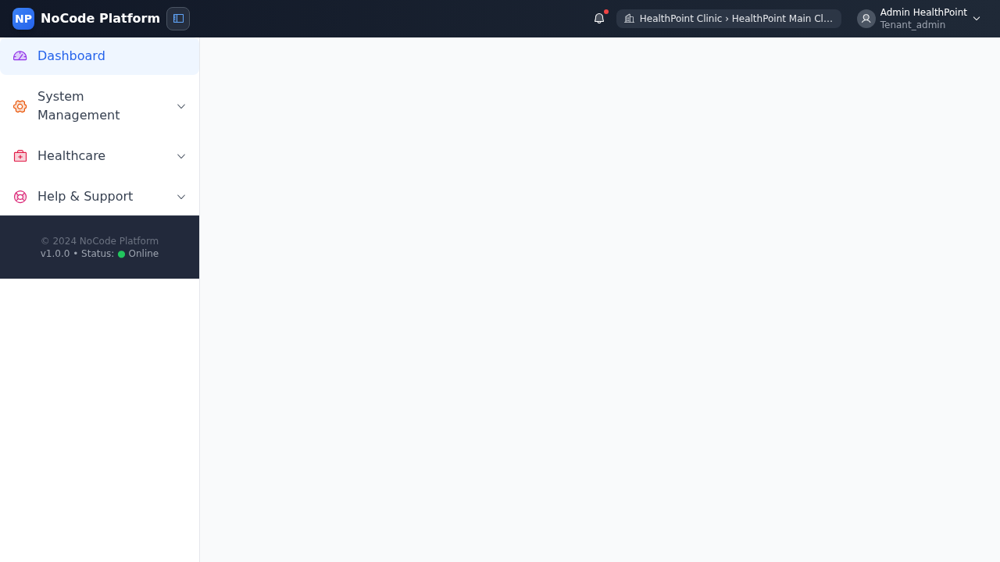
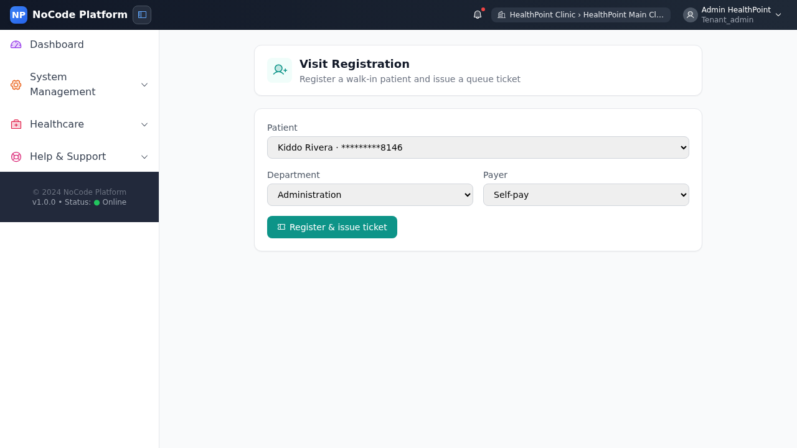
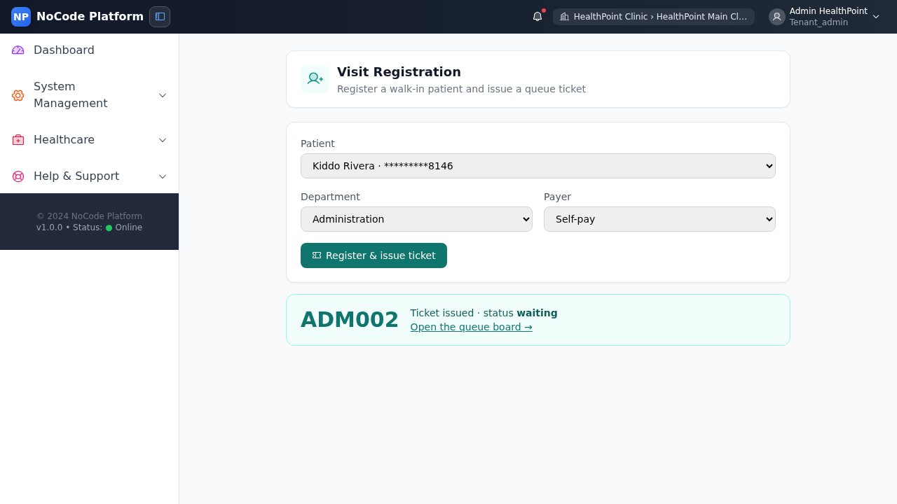
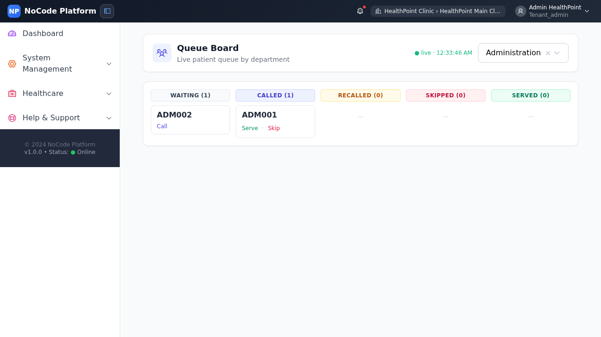
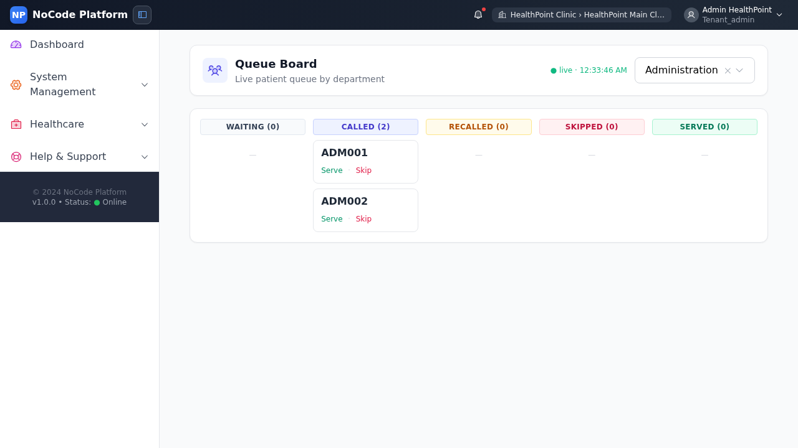
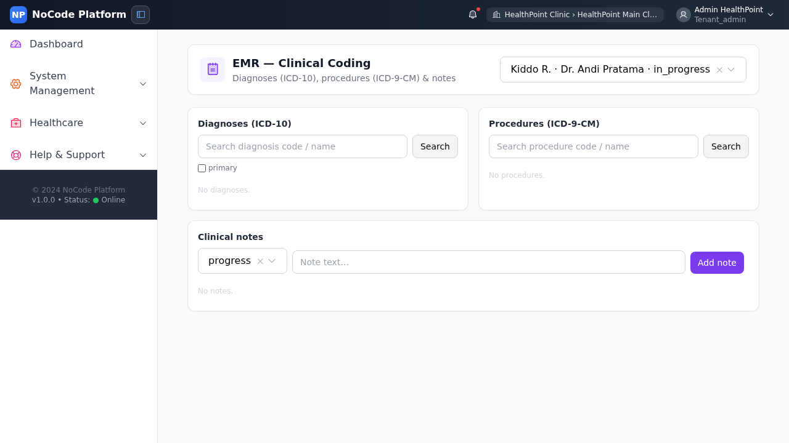
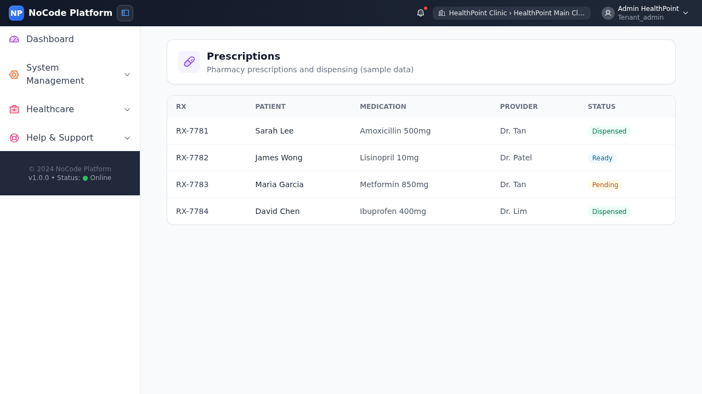
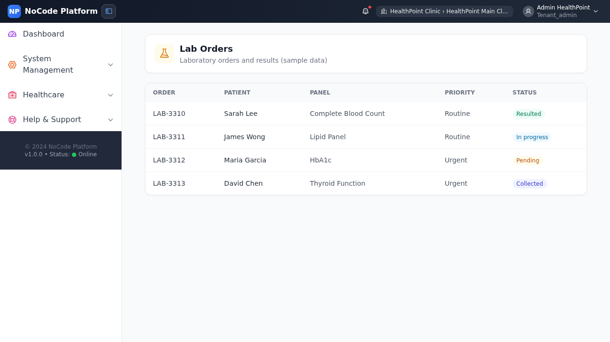
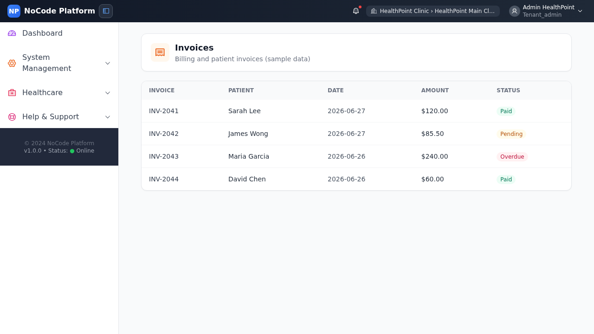
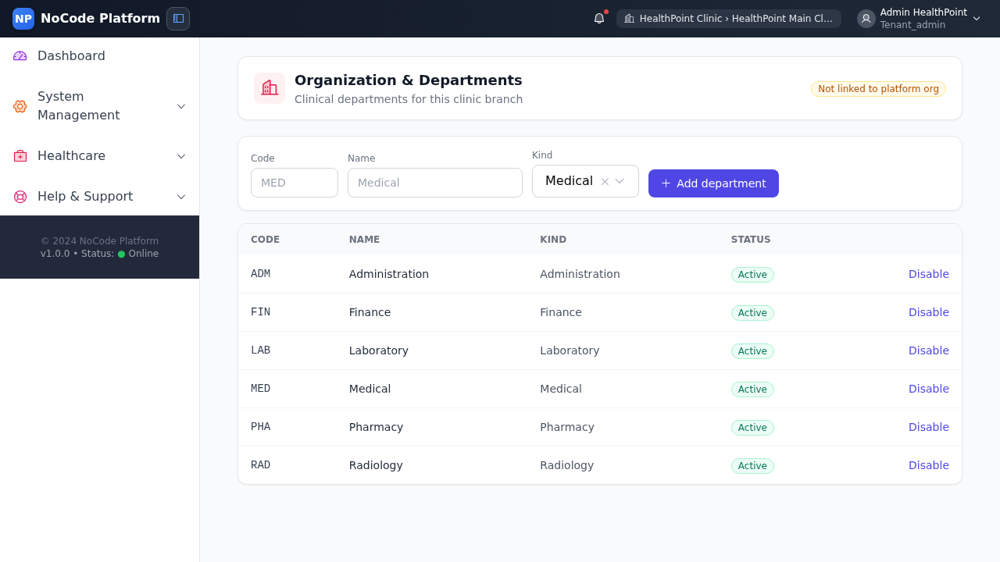

# Healthcare Clinic — Frontend E2E Journey

A Playwright end-to-end test that drives the **real clinic staff UI** (not the API) through
the front-desk → clinical → billing spine, capturing a screenshot at every step. It is the
UI counterpart to the backend clinical-journey e2e
(`backend/tests/e2e/test_healthcare_clinical_journey.py`).

- **Spec:** [`frontend/tests/e2e/healthcare-clinic-journey.spec.js`](../frontend/tests/e2e/healthcare-clinic-journey.spec.js)
- **Screenshots:** `frontend/tests/e2e/screenshots/clinic-journey/`
- **Actor:** the seeded clinic owner `admin@healthpoint.com` (holds all `healthcare:*:read`
  permissions, so every clinic page is navigable), against the **HealthPoint Main** clinic.

## Run it

```bash
# with the docker dev stack up (frontend nginx :8080, API :8000)
cd frontend
npx playwright test tests/e2e/healthcare-clinic-journey.spec.js --reporter=list
```

The suite **skips cleanly** (never fails red) if the stack or the seeded owner isn't
reachable, so it's safe in any environment. Last run: **1 passed (22.5s)**.

## What it proves

The first three steps are **real interactions** against the backend — a walk-in visit and a
queue ticket are created, then the ticket is **called** and the test asserts it genuinely
moves to the *Called* column (ticket-specific: the card loses its **Call** action and gains
**Serve**, not merely that the always-present "Called" column header exists). The remaining
steps navigate the clinical/billing pages and confirm each renders with live data.

> **Note — staff FE wiring gap (surfaced by this test):** **EMR / Clinical Coding** and
> **Organization & Departments** are wired to the real backend, but **Prescriptions**,
> **Lab Orders**, and **Invoices** are still *sample-data placeholder* pages in the staff
> frontend. Their backend APIs exist and are exercised by the backend e2e (and were fixed in
> the catalog/orders-billing PR), so wiring these three staff pages to those APIs is the
> natural follow-up.

---

## The journey, step by step

### 1. Sign in
Log in through the real login form (`#email` / `#password`), password-primary auth. The shell
loads with the **Healthcare** module menu registered — confirming RBAC granted the clinic
pages.



### 2. Visit Registration — the front desk
Navigate to **Visit Registration**. The form loads with the seeded patients and departments;
pick the payer (Self-pay) and register a walk-in under the front-desk default department.



### 3. Walk-in registered → queue ticket issued
Submitting registers the visit **and** issues a queue ticket in one step. The result panel
shows the ticket number and `status waiting`.



### 4. Queue Board — ticket waiting
On the live **Queue Board** (short-polls the branch queue), the new ticket sits in the
**Waiting** column with a **Call** action.



### 5. Call the ticket → Called
Clicking **Call** moves the ticket to the **Called** column — the card now offers **Serve /
Skip** instead of **Call**. This is the real state transition, asserted per-ticket.



### 6. EMR — Clinical Coding
The clinician's coding workspace, loaded against a real encounter: ICD-10 diagnosis search,
ICD-9-CM procedure search, and clinical notes.



### 7. Prescriptions (pharmacy)
The pharmacy prescriptions page. *(Sample-data placeholder — see the wiring-gap note above.)*



### 8. Lab Orders
The laboratory orders & results page. *(Sample-data placeholder.)*



### 9. Invoices (billing)
The billing/invoices page. *(Sample-data placeholder.)*



### 10. Organization & Departments
The clinic structure the whole journey ran against — the branch's departments, live from the
backend.


