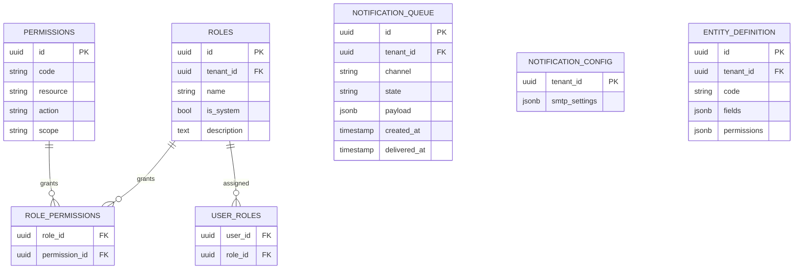

# schema-21 — Schema Design for 🔴 Risk Retirement (Sprint 1)

> **Verdict**: **no schema changes required.** Every constituent story in [`epic-21-risk-retirement`](../epics/epic-21-risk-retirement.md) operates over tables and columns that are already present in the codebase. This artifact records the evidence so downstream agents do not have to re-derive it.

---

## Per-story schema verification

| Item | Story | Required schema | Status | Evidence |
|------|-------|-----------------|--------|----------|
| 21.1 | 15.1.1 — Layout Component Suite | none (pure frontend) | ✅ | No backend touched |
| 21.2 | 14.2.1 — SMTP Email Delivery Adapter | `notification_queue` table for the worker to consume | ✅ already exists | `app/models/notification_queue.py:7 NotificationQueue` (per `audit-14` story 14.1.1 DONE); `app/models/notification_config.py:16 NotificationConfig` (per 14.1.2 DONE) |
| 21.3a | 4.1.1 — Role CRUD | `roles` table with `is_system` flag; `role_permissions` junction | ✅ already exists | `app/models/role.py:17 Role`, `app/models/role.py is_system` (per `audit-04` story 4.1.1 — model in place; only endpoints missing); `app/models/rbac_junctions.py:7 RolePermission` (4.1.2 DONE) |
| 21.3b | 4.2.1 — Wildcard Permissions | `permissions` table to look up by code | ✅ already exists | `GET /permissions` endpoint serves the catalog per `audit-04` 4.1.2 DONE — table is implied and proven by the working endpoint |
| 21.4 | 4.2.4 — Per-Entity Permission Enforcement | `EntityDefinition.permissions` JSONB column | ✅ already exists | `app/models/data_model.py:91 EntityDefinition.permissions` (per `audit-04` 4.2.4 — column is "schema-only" / dead weight today; this story wires it in) |

**No table creations, no column additions, no index additions, no constraint changes.** Only application-code reads/writes are involved (covered by `arch-21` §7 Reference Map).

## ER diagram (touched tables, all unchanged)

**Diagram is illustrative**, not normative — exact column types and constraints are owned by the existing model files cited above.

## Tenant-scoping rules (carried forward)

All affected tables already carry `tenant_id` (or are tenant-scoped via parent FK):

- `roles.tenant_id` — system roles use a sentinel tenant or are global per `is_system = true` (verify with C2 during implementation if ambiguous)
- `notification_queue.tenant_id` — present
- `entity_definition.tenant_id` — present
- `permissions` — global catalog; access mediated by `role_permissions` which is tenant-scoped via the role

Vision-01 §6 guardrail ("tenant data isolation is the platform's existential guarantee") therefore applies but is not weakened by epic-21 — no new isolation surface is introduced.

## Migration plan

**No Alembic migration required.** Confirmed by:

- No `op.create_table`, `op.add_column`, or `op.create_index` candidates in epic-21 scope
- `arch-21` §2 explicitly identifies only application-code modifications (services, routers, a worker, frontend components) — zero schema files in §7 Reference Map

Per the AGENT_STANDARD §6 communication contract, this artifact still ships at `status: review` so C1's DoR is satisfied (epic, arch, **schema**, and UILDC sections all approved).

## Rollback plan

Not applicable — no migration to roll back.

## Decisions

- Producing `schema-21.md` rather than skipping the artifact: explicit > implicit. C1's DoR cites schema as a required input; a "no-changes" doc satisfies the gate while making the verification auditable.
- No mermaid diagram of the worker's read pattern against `notification_queue` here — that's an architectural concern owned by `arch-21` §3.1.

## Open Questions

None for this slice. Schema impact is bounded to zero by audit evidence.

## Hand-off

`status: review`. Once approved:
- **C1 Tech Lead** — DoR for schema is satisfied; can proceed once B3 (UILDC review) also approves.
- **C2 Backend Developer** — no migration work; do NOT generate an empty Alembic revision for this epic.
- **D1 QA Engineer** — no DB-state pre-conditions to set up beyond fixtures the existing tables already use.
- **D3 Security Engineer** — no new PII surface; no new tenant-scope boundary; review focus stays on application-layer (wildcard algorithm, SMTP credential handling per `arch-21` §6).
