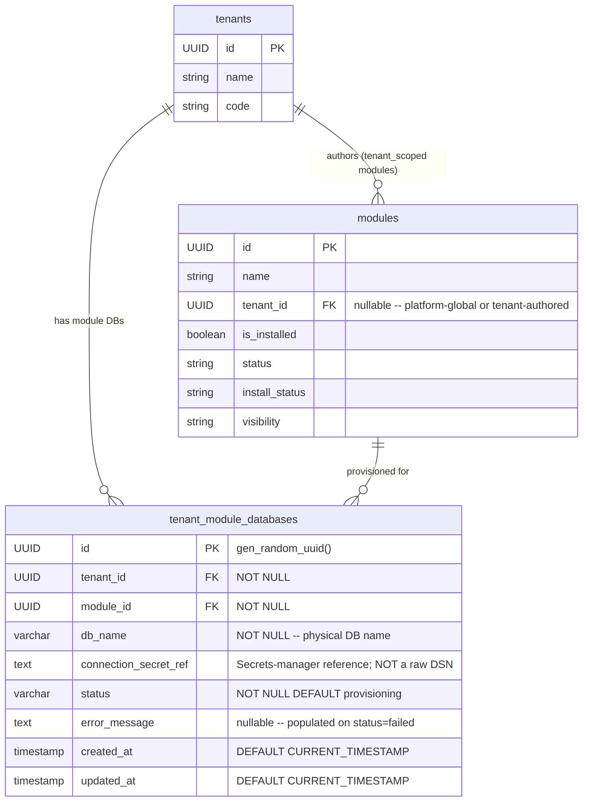

# Schema Design -- Epic 22: Tenant Isolation Hardening (schema-22)

---

## 1. Existing Model Assessment

Epic 22 closes the highest residual platform risk: ad-hoc per-service `tenant_id` filters with no enforcement layer. The schema changes for this epic are **minimal by design**:

- **Feature 22.2 + 22.3 (Shared-Core Hardening)**: No DDL changes. `__tenant_scoped__ = True` is a Python class attribute that the ORM listener reads at runtime -- it lives in source code, not in the database schema.
- **Feature 22.4 (Module-DB-per-Tenant)**: One new table: `tenant_module_databases`. Migration `pg_tenant_module_databases.py` **already exists** at `backend/app/alembic/versions/postgresql/pg_tenant_module_databases.py` (revision ID: `pg_tenant_module_databases`, down-revision: `pg_merge_lifecycle_main`).
- **No new columns on existing tables**: `arch-22.md` section 8.2 confirms shared-core hardening adds no new columns to any existing model.

**Conclusion**: The data model for Epic 22 requires **one new table** (`tenant_module_databases`), already migrated. The `__tenant_scoped__` attribute rollout is a code-only change; no DDL is needed.

---

## 2. ER Diagram



---

## 3. New Table: `tenant_module_databases`

**Status**: Migration already exists (`pg_tenant_module_databases.py`). No new migration required.

### 3.1 Full Column Specification

| Column | Type | Nullable | Default | Notes |
|--------|------|----------|---------|-------|
| `id` | UUID | NOT NULL | `gen_random_uuid()` | PK |
| `tenant_id` | UUID | NOT NULL | -- | References `tenants.id`; no FK constraint in raw-DDL migration (see TD-1) |
| `module_id` | UUID | NOT NULL | -- | References `modules.id`; no FK constraint in raw-DDL migration (see TD-1) |
| `db_name` | VARCHAR(255) | NOT NULL | -- | Physical database name, e.g. `{tenant_id}_{module_id}` |
| `connection_secret_ref` | TEXT | NULL | -- | Secrets-manager reference -- see section 3.2; never a raw DSN |
| `status` | VARCHAR(30) | NOT NULL | `'provisioning'` | Lifecycle state -- see section 3.3 |
| `error_message` | TEXT | NULL | -- | Populated when `status = 'failed'`; cleared on successful retry |
| `created_at` | TIMESTAMP | NULL | `CURRENT_TIMESTAMP` | Row creation time |
| `updated_at` | TIMESTAMP | NULL | `CURRENT_TIMESTAMP` | Last status update; application layer must set on write |

### 3.2 `connection_secret_ref` Format

Stores a **reference** to the credential, not the credential itself. `ModuleScopeMiddleware` resolves the secret at connection-pool initialization from the named provider. Three supported formats:

| Format | Example | Provider |
|--------|---------|---------|
| `vault:<path>` | `vault:secret/data/tenants/abc123/financial` | HashiCorp Vault |
| `env:<VAR_NAME>` | `env:TENANT_ABC123_FINANCIAL_DB_URL` | Environment variable (dev/CI) |
| `arn:aws:secretsmanager:<region>:<account>:secret:<name>` | `arn:aws:secretsmanager:us-east-1:123456789012:secret:tenants/abc123/financial-AbCdEf` | AWS Secrets Manager |

The raw DSN is **never** persisted in this column. This is the H-2 resolution from `sec-review-22.md`.

### 3.3 `status` Lifecycle

| Value | Meaning | Transitions to |
|-------|---------|---------------|
| `provisioning` | DB creation + Alembic migrations in flight | `ready`, `failed` |
| `ready` | Provisioning complete; module is live for this tenant | `archived` (offboarding) |
| `failed` | Provisioning or migration failed; `error_message` is set | `provisioning` (retry on re-enable) |
| `archived` | Tenant offboarding: DB renamed per `TENANT_DELETION_POLICY=archive` | -- |

Note: `TENANT_DELETION_POLICY=drop` removes rows entirely rather than transitioning to `archived`.

---

## 4. No New Columns on Existing Tables

`arch-22.md` section 8.2 is authoritative: shared-core hardening (Features 22.2 + 22.3) introduces no DDL changes to existing tables. Specifically:

- **`__tenant_scoped__ = True`** is a Python class attribute on SQLAlchemy model classes. The ORM listener (`TenantScopeListener`) reads it at query compile time. Nothing is stored in the database.
- **`apply_tenant_scope`** uses the existing `tenant_id` columns already present on all tenant-scoped models.
- **`audit_log` table**: receives new event type strings (`tenant.cross_scope.enter`, `tenant.cross_scope.exit`, `tenant.scope_missing`, `tenant.module_dbs.cleanup`) but no schema change -- these are values written to the existing `action` column.

---

## 5. SQLAlchemy Model Changes -- `__tenant_scoped__` Rollout

No new model file is required for the listener registration itself. The changes for Epic 22 are:

1. Add `__tenant_scoped__ = True` as a class attribute to models with `tenant_id NOT NULL`.
2. Create a new `TenantModuleDatabase` ORM class (the table exists from the migration, but has no corresponding ORM model).

### 5.1 Models Requiring `__tenant_scoped__ = True`

C2 must add this class attribute during Feature 22.3 implementation (story 22.3.1):

| File | Class | Table | `tenant_id` nullability |
|------|-------|-------|------------------------|
| `backend/app/models/user.py` | `User` | `users` | NOT NULL |
| `backend/app/models/company.py` | `Company` | `companies` | NOT NULL |
| `backend/app/models/branch.py` | `Branch` | `branches` | NOT NULL |
| `backend/app/models/department.py` | `Department` | `departments` | NOT NULL |
| `backend/app/models/group.py` | `Group` | `groups` | NOT NULL |
| `backend/app/models/report.py` | `ReportDefinition` | `report_definitions` | NOT NULL |
| `backend/app/models/report.py` | `ReportExecution` | `report_executions` | NOT NULL |
| `backend/app/models/report.py` | `ReportSchedule` | `report_schedules` | NOT NULL |
| `backend/app/models/report.py` | `ReportCache` | `report_cache` | NOT NULL |
| `backend/app/models/dashboard.py` | `Dashboard` | `dashboards` | NOT NULL |
| `backend/app/models/dashboard.py` | `DashboardPage` | `dashboard_pages` | NOT NULL |
| `backend/app/models/dashboard.py` | `DashboardWidget` | `dashboard_widgets` | NOT NULL |
| `backend/app/models/dashboard.py` | `DashboardShare` | `dashboard_shares` | NOT NULL |
| `backend/app/models/dashboard.py` | `DashboardSnapshot` | `dashboard_snapshots` | NOT NULL |
| `backend/app/models/dashboard.py` | `WidgetDataCache` | `widget_data_cache` | NOT NULL |
| `backend/app/models/builder_page.py` | `BuilderPage` | `builder_pages` | NOT NULL |
| `backend/app/models/module_service.py` | `ModuleServiceAccessLog` | `module_service_access_log` | NOT NULL |
| `backend/app/models/nocode_module.py` | `ModuleActivation` | `module_activations` | NOT NULL |

### 5.2 Models Explicitly Excluded from `__tenant_scoped__`

These models carry `tenant_id` but are platform-global or dual-mode (NULL = system-wide row, UUID = tenant-specific row):

| File | Class | Table | Reason |
|------|-------|-------|--------|
| `backend/app/models/nocode_module.py` | `Module` | `modules` | Platform-global catalog; `tenant_id` nullable (NULL = operator-installed platform module) |
| `backend/app/models/role.py` | `Role` | `roles` | Dual-mode: NULL = system role available to all tenants |
| `backend/app/models/audit.py` | `AuditLog` | `audit_logs` | Platform-wide; cross-tenant admin reads are legitimate |
| `backend/app/models/security_policy.py` | `SecurityPolicy` | `security_policies` | Dual-mode: NULL = system default policy |
| `backend/app/models/notification_config.py` | `NotificationConfig` | `notification_config` | Dual-mode: NULL = system default |
| `backend/app/models/notification_queue.py` | `NotificationQueue` | `notification_queue` | Platform delivery queue; nullable `tenant_id` |
| `backend/app/models/menu_item.py` | `MenuItem` | `menu_items` | Dual-mode: NULL = system-wide menu items |
| `backend/app/models/scheduler.py` | `SchedulerConfig` | `scheduler_configs` | Dual-mode: NULL = system level |
| `backend/app/models/scheduler.py` | `SchedulerJob` | `scheduler_jobs` | Dual-mode: NULL = system level |
| `backend/app/models/workflow.py` | `WorkflowDefinition` | `workflow_definitions` | Dual-mode: NULL = platform-level workflow |
| `backend/app/models/workflow.py` | `WorkflowState` | `workflow_states` | Dual-mode: NULL = platform-level |
| `backend/app/models/workflow.py` | `WorkflowTransition` | `workflow_transitions` | Dual-mode: NULL = platform-level |
| `backend/app/models/workflow.py` | `WorkflowInstance` | `workflow_instances` | Dual-mode: NULL = platform-level |
| `backend/app/models/workflow.py` | `WorkflowHistory` | `workflow_history` | Dual-mode: NULL = platform-level |
| `backend/app/models/data_model.py` | `EntityDefinition` | `entity_definitions` | Dual-mode: NULL = platform-level entity |
| `backend/app/models/data_model.py` | `FieldDefinition` | `field_definitions` | Dual-mode: NULL = platform-level |
| `backend/app/models/data_model.py` | `FieldGroup` | `field_groups` | Dual-mode: NULL = platform-level |
| `backend/app/models/data_model.py` | `RelationshipDefinition` | `relationship_definitions` | Dual-mode: NULL = platform-level |
| `backend/app/models/data_model.py` | `IndexDefinition` | `index_definitions` | Dual-mode: NULL = platform-level |
| `backend/app/models/data_model.py` | `EntityMigration` | `entity_migrations` | Dual-mode: NULL = platform-level |
| `backend/app/models/lookup.py` | `LookupConfiguration` | `lookup_configurations` | Dual-mode: NULL = platform-level |
| `backend/app/models/lookup.py` | `LookupCache` | `lookup_cache` | Dual-mode: NULL = platform-level |
| `backend/app/models/lookup.py` | `CascadingLookupRule` | `cascading_lookup_rules` | Dual-mode: NULL = platform-level |
| `backend/app/models/automation.py` | `AutomationRule` | `automation_rules` | Dual-mode: NULL = platform-level |
| `backend/app/models/automation.py` | `AutomationExecution` | `automation_executions` | Dual-mode: NULL = platform-level |
| `backend/app/models/automation.py` | `ActionTemplate` | `action_templates` | Dual-mode: NULL = system template |
| `backend/app/models/automation.py` | `WebhookConfig` | `webhook_configs` | Dual-mode: NULL = platform-level |

### 5.3 New ORM Model: `TenantModuleDatabase` (tech debt TD-3)

The table exists (migration already run), but no ORM model was created at migration time. C2 creates `backend/app/models/tenant_module_database.py` as part of story 22.4.1:

```python
from sqlalchemy import Column, String, Text, DateTime, UniqueConstraint, Index
from sqlalchemy.sql import func
from backend.app.models.base import Base
from backend.app.core.db import GUID

class TenantModuleDatabase(Base):
    __tablename__ = "tenant_module_databases"
    # NOT marked __tenant_scoped__ -- provisioning/cleanup scripts need
    # cross-tenant visibility via with_admin_cross_tenant_scope()

    id = Column(GUID, primary_key=True, server_default=func.gen_random_uuid())
    tenant_id = Column(GUID, nullable=False, index=True)
    module_id = Column(GUID, nullable=False, index=True)
    db_name = Column(String(255), nullable=False)
    connection_secret_ref = Column(Text, nullable=True)
    status = Column(String(30), nullable=False, server_default="provisioning")
    error_message = Column(Text, nullable=True)
    created_at = Column(DateTime, server_default=func.current_timestamp())
    updated_at = Column(DateTime, server_default=func.current_timestamp(),
                        onupdate=func.current_timestamp())

    __table_args__ = (
        UniqueConstraint("tenant_id", "module_id",
                         name="uq_tenant_module_databases_tenant_module"),
        Index("ix_tenant_module_databases_tenant_id", "tenant_id"),
        Index("ix_tenant_module_databases_module_id", "module_id"),
    )
```

---

## 6. Index Strategy

### 6.1 `tenant_module_databases` (new table)

Already created by `pg_tenant_module_databases.py`:

| Index name | Columns | Purpose |
|------------|---------|---------|
| `ix_tenant_module_databases_tenant_id` | `(tenant_id)` | Offboarding lookup: find all module DBs for a tenant in `cleanup_tenant_module_dbs` |
| `ix_tenant_module_databases_module_id` | `(module_id)` | Fan-out lookup: find all tenant DBs for a module in `migrate-module.py` |
| `UNIQUE(tenant_id, module_id)` | `(tenant_id, module_id)` | Prevents double-provisioning (sec-review-22 I-3 verified) |

No index on `status` is required; cardinality is O(tenants x modules) -- a full scan on status is cheaper than index overhead at this scale.

### 6.2 Existing Tenant-Scoped Table Indexes (verified present)

All 18 models in section 5.1 already carry `tenant_id` indexes. Selected confirmations from source:

| Table | Existing index |
|-------|---------------|
| `users` | `index=True` on column declaration (`user.py:38`) |
| `companies` | `index=True` on column declaration (`company.py:29`) |
| `branches` | `index=True` on column declaration (`branch.py:28`) |
| `departments` | `index=True` on column declaration (`department.py:30`) |
| `groups` | `ix_group_tenant_company` composite index (`group.py:69`) |
| `report_definitions` | `index=True` on column declaration (`report.py:62`) |
| `dashboards` | `index=True` on column declaration (`dashboard.py:67`) |
| `module_activations` | `idx_module_activations_tenant` (`nocode_module.py:259`) |
| `builder_pages` | `index=True` on column declaration (`builder_page.py:18`) |
| `module_service_access_log` | `idx_service_access_tenant` (`module_service.py:132`) |

No new `tenant_id` indexes required. `apply_tenant_scope` adds `WHERE tenant_id = ?` which uses these existing indexes.

---

## 7. Constraints

### 7.1 `tenant_module_databases` (from existing migration)

| Constraint | Type | Definition |
|------------|------|-----------|
| `tenant_module_databases_pkey` | PRIMARY KEY | `(id)` |
| implicit unique index | UNIQUE | `(tenant_id, module_id)` -- prevents double-provisioning |

**Missing FK constraints** (tech debt TD-1): `tenant_id` and `module_id` reference `tenants.id` and `modules.id` but raw-DDL migration omitted `FOREIGN KEY` clauses. Application layer enforces referential integrity; a follow-up migration can formalize.

**Missing CHECK constraint on `status`** (tech debt TD-2): validated in service layer. Can be added in a follow-up migration:

```sql
ALTER TABLE tenant_module_databases
  ADD CONSTRAINT ck_tenant_module_db_status
  CHECK (status IN ('provisioning', 'ready', 'failed', 'archived'));
```

### 7.2 Existing Table Constraints Unchanged

Epic 22 does not alter any constraints on existing tables.

---

## 8. Migration Plan

### 8.1 What Already Exists

| Migration file | Revision ID | Down-revision | What it does | Status |
|---------------|-------------|--------------|-------------|--------|
| `pg_tenant_module_databases.py` | `pg_tenant_module_databases` | `pg_merge_lifecycle_main` | Creates `tenant_module_databases` table; PK, UNIQUE(tenant_id, module_id), two indexes | **Already exists -- no action needed** |

### 8.2 What Needs to Be Created

No additional Alembic migrations are required for Epic 22. All DDL for the epic is covered by the existing migration. The `__tenant_scoped__` rollout and `TenantModuleDatabase` ORM model are code-only changes.

**Optional follow-up migrations** (not this sprint, tracked as TD-1 and TD-2 in section 11):
1. FK constraints on `tenant_module_databases`.
2. CHECK constraint on `tenant_module_databases.status`.

### 8.3 Migration Chain Context

```
pg_merge_lifecycle_main
    +-- pg_tenant_module_databases   <- Epic 22 (already merged)

pg_unify_module_system
    +-- pg_module_lifecycle_columns  <- Epic 23 (separate chain, no conflict)
```

---

## 9. Tenant-Scoping Rules Summary

| Table | Tenant-scoped? | `tenant_id` nullability | `__tenant_scoped__`? | Rationale |
|-------|---------------|------------------------|---------------------|-----------|
| `tenant_module_databases` | Registry -- not scoped | NOT NULL | Not marked | Admin scripts need cross-tenant access via `with_admin_cross_tenant_scope()` |
| `users` | Yes | NOT NULL | Yes | Hard per-tenant ownership |
| `companies` | Yes | NOT NULL | Yes | Hard per-tenant ownership |
| `branches` | Yes | NOT NULL | Yes | Hard per-tenant ownership |
| `departments` | Yes | NOT NULL | Yes | Hard per-tenant ownership |
| `groups` | Yes | NOT NULL | Yes | Hard per-tenant ownership |
| `module_activations` | Yes | NOT NULL | Yes | Per-tenant activation record |
| `report_definitions` | Yes | NOT NULL | Yes | Per-tenant reports |
| `report_executions` | Yes | NOT NULL | Yes | Per-tenant execution history |
| `report_schedules` | Yes | NOT NULL | Yes | Per-tenant schedules |
| `report_cache` | Yes | NOT NULL | Yes | Per-tenant cache |
| `dashboards` | Yes | NOT NULL | Yes | Per-tenant dashboards |
| `dashboard_pages` | Yes | NOT NULL | Yes | Per-tenant |
| `dashboard_widgets` | Yes | NOT NULL | Yes | Per-tenant |
| `dashboard_shares` | Yes | NOT NULL | Yes | Per-tenant |
| `dashboard_snapshots` | Yes | NOT NULL | Yes | Per-tenant |
| `widget_data_cache` | Yes | NOT NULL | Yes | Per-tenant |
| `builder_pages` | Yes | NOT NULL | Yes | Per-tenant builder pages |
| `module_service_access_log` | Yes | NOT NULL | Yes | Per-tenant service audit |
| `modules` | No -- platform global | Nullable | Not marked | Platform catalog |
| `roles` | No -- dual-mode | Nullable | Not marked | NULL = system role |
| `audit_logs` | No -- platform log | Nullable | Not marked | Cross-tenant admin visibility required |
| All dual-mode tables (see section 5.2) | No | Nullable | Not marked | NULL rows serve all tenants |

---

## 10. Backward Compatibility

### 10.1 DDL Changes

**`pg_tenant_module_databases` migration** -- fully non-destructive:
- Adds a new table only; no existing table is modified.
- `downgrade()` runs `DROP TABLE IF EXISTS tenant_module_databases` -- safe; table is empty before first provisioning run.
- No data loss on downgrade.

**No other DDL changes in this epic.**

### 10.2 Code-Level Backward Compatibility

Adding `__tenant_scoped__ = True` to model classes is additive. The listener fires only after `TenantScopeListener.install(engine)` is called at FastAPI lifespan startup. C2 must follow the rollout order below to avoid spurious 500s:

**Rollout order** (enforced by task ordering in `tasks-22.md`):
1. **Story 22.2.1** -- implement `scope.py` helper (no listener active yet)
2. **Story 22.2.2** -- migrate all services to `apply_tenant_scope`
3. **Story 22.3.2** -- deploy `tenant_scoped_session` dependency to all tenant-scoped routes
4. **Story 22.3.1** -- install `TenantScopeListener` at FastAPI lifespan startup (listener goes live last)

Installing the listener before step 3 causes `TenantScopeMissingError` (HTTP 500) on any route not yet migrated.

### 10.3 Rollback Story

| Change | Rollback mechanism | Risk |
|--------|-------------------|------|
| `pg_tenant_module_databases` migration | `alembic downgrade pg_merge_lifecycle_main` drops the table | Low -- new table; no pre-existing data |
| `__tenant_scoped__` class attributes | Remove the attribute from each model class | Low -- Python-only; no DB change |
| `TenantScopeListener.install()` | Remove call from FastAPI lifespan startup | Low -- Python registration step |
| `tenant_scoped_session` dependency | Revert routes to `Depends(get_db)` | Low -- FastAPI dependency swap |

No migration in this epic is destructive.

---

## 11. Open Questions / Tech Debt

| ID | Item | Owner | Sprint |
|----|------|-------|--------|
| M-1 | New models added post-sprint without `__tenant_scoped__ = True` get no listener protection; no automated detection | D3 / C2 | N+1 |
| M-2 | Router-layer raw `.tenant_id ==` literals not fully migrated; `check-tenant-scope` gate extended to `routers/` | C2 | N+1 |
| TD-1 | FK constraints missing from `pg_tenant_module_databases` migration | B2 | Follow-up migration |
| TD-2 | CHECK constraint on `tenant_module_databases.status` not in migration | B2 | Follow-up migration |
| TD-3 | `TenantModuleDatabase` SQLAlchemy ORM class not yet created (table exists from migration; model missing) | C2 | This sprint (story 22.4.1) |
