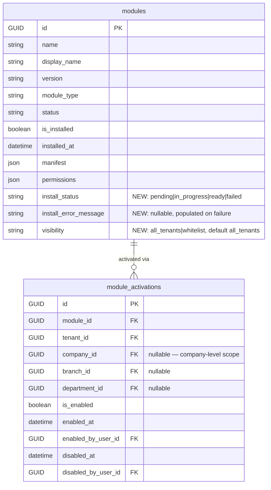

# Schema Design — Epic 23: Module Lifecycle & Activation (schema-23)

---

## 1. Existing Model Assessment

After reviewing `backend/app/models/nocode_module.py`, the existing `modules` and `module_activations` tables already cover the vast majority of what epic-23 requires:

**`modules` table — already has:**
- `is_installed` (Boolean) — tracks installation
- `installed_at`, `installed_by_user_id` — install audit
- `manifest`, `permissions`, `dependencies_json` — manifest data
- `status` — module lifecycle status (draft/available/stable/deprecated)

**`module_activations` table — already has:**
- `tenant_id`, `company_id`, `branch_id`, `department_id` — full org hierarchy scoping
- `is_enabled` — activation state
- `enabled_at`, `enabled_by_user_id`, `disabled_at`, `disabled_by_user_id` — activation audit
- Unique constraint `(module_id, tenant_id, company_id, branch_id, department_id)` — prevents double-activation

**Conclusion**: the data model is architecturally sound. Epic 23 requires **3 additive columns** on the `modules` table only. No new tables needed. No changes to `module_activations`.

---

## 2. ER Diagram (delta only — existing tables shown with additions highlighted)



---

## 3. New Columns — `modules` table

### 3.1 `install_status` (VARCHAR 20, NOT NULL, DEFAULT 'ready')

Tracks the atomic install pipeline state. The install pipeline writes this column at each step.

| Value | Meaning |
|---|---|
| `pending` | Registered but install pipeline not yet run (legacy nocode modules) |
| `in_progress` | Install pipeline running — do not serve to tenants |
| `ready` | Install complete, hooks fired, available for activation |
| `failed` | Install failed, rollback applied — see `install_error_message` |
| `deactivation_pending` | Operator ran phase 1 uninstall (all tenants deactivated); awaiting phase 2 |

Default `'ready'` ensures existing `modules` rows are not disrupted by the migration.

**Index**: `ix_modules_install_status` on `(install_status)` — used by `GET /modules` to filter out `in_progress` and `failed` rows from the tenant-facing list.

### 3.2 `install_error_message` (TEXT, NULLABLE)

Populated when `install_status = 'failed'`. Contains the error message from the failed install step. Cleared on a successful re-install. Never surfaces to tenant admins — operator-only via admin API.

### 3.3 `visibility` (VARCHAR 20, NOT NULL, DEFAULT 'all_tenants')

Controls which tenants can see and activate the module.

| Value | Meaning |
|---|---|
| `all_tenants` | All tenants see the module in their Modules page |
| `whitelist` | Only tenants listed in `module_tenant_whitelist` (future table, deferred) can see it |

Default `'all_tenants'` matches current behaviour (all installed modules visible to all tenants). The `whitelist` value is reserved for future use; no `module_tenant_whitelist` table is created in this epic — just the enum value on the column.

**Index**: `ix_modules_visibility` on `(visibility)` — used by `GET /modules` to filter.

---

## 4. Tenant-Scoping Rules

| Table | Tenant-scoped? | Rule |
|---|---|---|
| `modules` | **No** — platform-global | `tenant_id` is nullable; NULL = platform-level module (installed by operator). Tenant-authored nocode modules carry a `tenant_id`. |
| `module_activations` | **Yes** | Every row carries `tenant_id NOT NULL`. Company/branch/dept are optional deeper scopes. |

`GET /modules` (tenant-facing) filters: `Module.install_status = 'ready' AND Module.visibility = 'all_tenants'` and joins `module_activations` for the requesting tenant's activation state. Superadmin sees all.

---

## 5. Migration Plan

**File**: `backend/app/alembic/versions/postgresql/pg_module_lifecycle_columns.py`
**Revision**: `pg_module_lifecycle_columns`
**Down-revision**: `pg_unify_module_system`

### upgrade()
```python
# install_status column
op.add_column('modules',
    sa.Column('install_status', sa.String(20), nullable=False, server_default='ready'))
op.create_index('ix_modules_install_status', 'modules', ['install_status'])

# install_error_message column
op.add_column('modules',
    sa.Column('install_error_message', sa.Text(), nullable=True))

# visibility column
op.add_column('modules',
    sa.Column('visibility', sa.String(20), nullable=False, server_default='all_tenants'))
op.create_index('ix_modules_visibility', 'modules', ['visibility'])

# CheckConstraints
op.create_check_constraint(
    'ck_modules_install_status',
    'modules',
    "install_status IN ('pending','in_progress','ready','failed','deactivation_pending')"
)
op.create_check_constraint(
    'ck_modules_visibility',
    'modules',
    "visibility IN ('all_tenants','whitelist')"
)
```

### downgrade()
```python
op.drop_constraint('ck_modules_visibility', 'modules', type_='check')
op.drop_constraint('ck_modules_install_status', 'modules', type_='check')
op.drop_index('ix_modules_visibility', table_name='modules')
op.drop_column('modules', 'visibility')
op.drop_column('modules', 'install_error_message')
op.drop_index('ix_modules_install_status', table_name='modules')
op.drop_column('modules', 'install_status')
```

---

## 6. SQLAlchemy Model Update (`backend/app/models/nocode_module.py`)

Add to the `Module` class after the existing `is_installed` column:

```python
# Install pipeline status (epic-23)
install_status = Column(
    String(20), nullable=False, default='ready',
    index=True
)  # pending | in_progress | ready | failed | deactivation_pending
install_error_message = Column(Text, nullable=True)

# Visibility (epic-23)
visibility = Column(
    String(20), nullable=False, default='all_tenants',
    index=True
)  # all_tenants | whitelist
```

Add `CheckConstraint` entries to `__table_args__`:
```python
CheckConstraint(
    "install_status IN ('pending','in_progress','ready','failed','deactivation_pending')",
    name='ck_modules_install_status'
),
CheckConstraint(
    "visibility IN ('all_tenants','whitelist')",
    name='ck_modules_visibility'
),
```

---

## 7. Rollback

The migration is fully reversible via `downgrade()`. Existing rows receive `install_status='ready'` and `visibility='all_tenants'` by the server defaults — no data loss. The migration runs in < 1 s on the current module count (single-digit rows).
