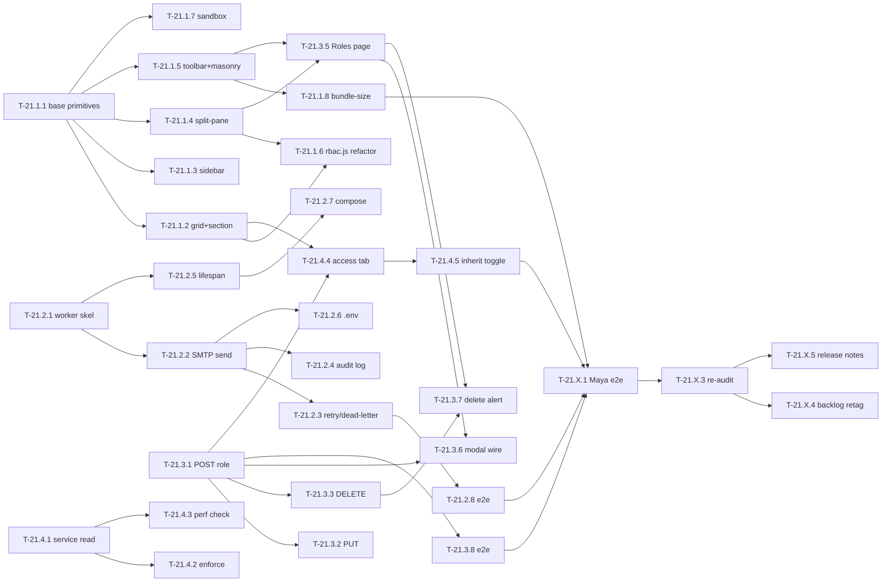

# tasks-21 — Sprint Backlog for 🔴 Risk Retirement (Sprint 1)

> **Upstream**: [`epic-21-risk-retirement`](../epics/epic-21-risk-retirement.md) (approved), [`arch-21`](../architecture/arch-21.md) (approved), [`adr-002-smtp-worker-placement`](../architecture/adr-002-smtp-worker-placement.md) (accepted), [`schema-21`](../architecture/schema-21.md) (approved).

---

## Sprint Goal

Retire the 5 🔴 risks named in [`vision-01`](../vision/vision-01-app-buildify.md) §7 so the next net-new feature epic can open on a clean foundation. Concretely:

1. The Maya-journey password-reset email arrives (closes step 8)
2. Tenant administrators can create + delete custom roles via API and UI (closes step 3)
3. Wildcard permissions actually wildcard (closes step 3)
4. Per-entity permissions are enforced (closes step 7)
5. Every UILDC v1.0 frontend story unblocks (closes the cross-cutting Flex layout-suite gap)

## Capacity Plan

| Role | Headcount | Hours over 10-day sprint |
|------|----------:|------------------------:|
| C2 Backend Developer | 2 | 160 |
| C3 Frontend Developer | 2 | 160 |
| D1 QA Engineer | 0.5 | 40 |
| E1 DevOps Engineer | 0.25 | 20 |
| D3 Security Engineer | 0.25 | 20 |
| **Total** | — | **400** |

Task estimates sum to ~310 hours, leaving ~90 hours buffer (~22%) for code review, status meetings, and unknowns. Adjust the headcount frontmatter if these assumptions don't match your team.

## Task Table

Status legend: `OPEN` = not started · `IN-PROGRESS` = picked up · `BLOCKED` = waiting · `REVIEW` = PR open · `DONE` = merged.

### Item 21.1 — Layout Component Suite (Story 15.1.1)

| id | title | owner | depends-on | hrs | AC link | status |
|----|-------|-------|-----------:|---:|---------|--------|
| T-21.1.1 | Implement `flex-stack.js` + `flex-cluster.js` + `flex-container.js` (simplest primitives, no responsive logic) | C3 | — | 8 | [epic-15 §15.1.1 — FlexStack/FlexCluster/FlexContainer](../epics/epic-15-flex-component-library.md) | DONE |
| T-21.1.2 | Implement `flex-grid.js` + `flex-section.js` (responsive columns; heading semantics) | C3 | T-21.1.1 (BaseComponent pattern) | 10 | [epic-15 §15.1.1 — FlexGrid/FlexSection](../epics/epic-15-flex-component-library.md) | DONE — flex-grid responsive via Tailwind prefixes (no FlexResponsive subscription needed); flex-section relocates `data-slot="actions"` children into the heading row; 9/9 column-logic tests pass |
| T-21.1.3 | Implement `flex-sidebar.js` (collapse threshold; subscribes to FlexResponsive.breakpointChange) | C3 | T-21.1.1 | 8 | [epic-15 §15.1.1 — FlexSidebar](../epics/epic-15-flex-component-library.md) | OPEN |
| T-21.1.4 | Implement `flex-split-pane.js` (drag handler, ARIA `role=separator`, clamp at min-left/min-right, `split-change` event) | C3 | T-21.1.1 | 12 | [epic-15 §15.1.1 — FlexSplitPane](../epics/epic-15-flex-component-library.md) | DONE — `data-slot="left|right"` slot capture; mouse drag + keyboard arrows (1% step); ARIA `role=separator` + `aria-valuenow`; constrained mode forces 50/50 + disables drag; 22/22 parse/clamp tests pass |
| T-21.1.5 | Implement `flex-toolbar.js` (sticky behavior + `stuck` state) + `flex-masonry.js` (column-count from viewport) | C3 | T-21.1.1 | 10 | [epic-15 §15.1.1 — FlexToolbar/FlexMasonry](../epics/epic-15-flex-component-library.md) | DONE — flex-toolbar 3-slot (start/default/end) + IntersectionObserver sentinel for `stuck` shadow; flex-masonry uses CSS column-width so browser handles re-layout (no JS resize listener); 10/10 length-parse tests pass |
| T-21.1.6 | Refactor `frontend/assets/js/rbac.js` to compose with new layout primitives (proves item 21.1 coordination AC) | C3 | T-21.1.1, T-21.1.2, T-21.1.4 | 6 | [epic-21 item 21.1 coordination AC](../epics/epic-21-risk-retirement.md) | OPEN |
| T-21.1.7 | Sandbox page exercising all 9 components — included in the dev shell, gated off in prod | C3 | T-21.1.1, T-21.1.2, T-21.1.3, T-21.1.4, T-21.1.5 | 4 | manual verification | OPEN |
| T-21.1.8 | Bundle-size measurement against the +10 KB budget per arch-21 §5 | C3 | T-21.1.5 | 2 | [arch-21 §5 NFRs](../architecture/arch-21.md) | OPEN |

**Subtotal: 60 hrs · Audit cite**: `audit-15-flex-component-library.md` story 15.1.1 (DRIFT — DONE-tagged but components MISSING).

### Item 21.2 — SMTP Email Delivery Adapter (Story 14.2.1)

| id | title | owner | depends-on | hrs | AC link | status |
|----|-------|-------|-----------:|---:|---------|--------|
| T-21.2.1 | Create `backend/app/workers/notification_worker.py` skeleton — polling consumer of pending `notification_queue` rows | C2 | — | 8 | [arch-21 §3.1 + §7 backend](../architecture/arch-21.md), [audit-14 14.1.1 cite](../architecture/audits/audit-14-notification-system.md) | DONE — polling-based instead of LISTEN/NOTIFY (simpler, more robust, same semantics; see commit notes); state machine 5/5 tests pass; `python -m app.workers.notification_worker` is the standalone entry point |
| T-21.2.2 | Implement SMTP send via `smtplib.SMTP_SSL` (or `aiosmtplib` per audit-14 4.2.1 hint); render template via jinja2 | C2 | T-21.2.1 | 10 | [epic-14 14.2.1 backend AC](../epics/epic-14-notification-system.md) | DONE — `smtplib.SMTP` + `starttls()` for TLS path; plain path for local-dev MailHog; jinja2 with `StrictUndefined`; 17/17 inline assertions pass |
| T-21.2.3 | Retry/backoff (5/30/300 s) + dead-letter on max retries; state column updates on `notification_queue` | C2 | T-21.2.2 | 6 | [arch-21 §3.1](../architecture/arch-21.md) | OPEN |
| T-21.2.4 | Audit log entries `notification.delivered` / `notification.failed` | C2 | T-21.2.2 | 4 | [arch-21 §2.3](../architecture/arch-21.md) | DONE — only terminal outcomes audited (delivered + dead-letter); transient retries are logger-only to avoid spam; audit failures swallowed (notification already committed) |
| T-21.2.5 | Add `NOTIFICATION_WORKER_INPROCESS` env var + lifespan integration in `backend/app/main.py` (per adr-002) | C2 | T-21.2.1 | 4 | [adr-002 Decision](../architecture/adr-002-smtp-worker-placement.md) | DONE — daemon thread started after module-system init; `setup_signals=False` because non-main thread; graceful stop with 10s join on shutdown |
| T-21.2.6 | Add `SMTP_HOST/PORT/USER/PASSWORD/FROM` to `.env.example` + secrets-handling note in deployment docs | E1 | T-21.2.2 | 2 | [arch-21 §4](../architecture/arch-21.md) | OPEN |
| T-21.2.7 | Add `notification-worker` service to `docker-compose.yml` (prod) — Epic 19 follow-up entry | E1 | T-21.2.5 | 4 | [adr-002 Consequences](../architecture/adr-002-smtp-worker-placement.md) | OPEN |
| T-21.2.8 | E2E: trigger `POST /auth/forgot-password` against a local MailHog (or equivalent) and verify the email arrives | D1 | T-21.2.3, T-21.2.4 | 6 | [epic-21 sprint-level DoD](../epics/epic-21-risk-retirement.md) | OPEN |

**Subtotal: 44 hrs · Audit cite**: `audit-14-notification-system.md` Feature 14.2 (MISSING).

### Item 21.3 — Role CRUD + Wildcard Permissions (Stories 4.1.1 + 4.2.1)

| id | title | owner | depends-on | hrs | AC link | status |
|----|-------|-------|-----------:|---:|---------|--------|
| T-21.3.1 | Implement `POST /api/v1/rbac/roles` — tenant-scoped, `is_system=false`, optional `copy_permissions_from` | C2 | — | 6 | [epic-04 4.1.1 backend AC](../epics/epic-04-rbac-permissions.md) | DONE |
| T-21.3.2 | Implement `PUT /api/v1/rbac/roles/{id}` — block updates to `is_system=true` rows (409) | C2 | T-21.3.1 | 4 | [epic-04 4.1.1 backend AC](../epics/epic-04-rbac-permissions.md) | DONE — system roles return 403 (immutable), per Pydantic+model semantics |
| T-21.3.3 | Implement `DELETE /api/v1/rbac/roles/{id}` — 409 with `dependent_count` if assigned to users or groups | C2 | T-21.3.1 | 5 | [epic-04 4.1.1 backend AC](../epics/epic-04-rbac-permissions.md) | DONE |
| T-21.3.4 | Update `auth_service.has_permission()` for `*` segment matching; benchmark target p95 < 5 ms for users with up to 200 perms | C2 | — | 6 | [epic-04 4.2.1 backend AC](../epics/epic-04-rbac-permissions.md), [arch-21 §3.2](../architecture/arch-21.md) | DONE — measured 6µs/call, 816× headroom under NFR |
| T-21.3.5 | Build Roles page — uses `FlexSplitPane` (T-21.1.4), `FlexStack` (T-21.1.1), existing `FlexCard` + `FlexToolbar` from layout-suite + 15.1.2 | C3 | T-21.1.4, T-21.1.5 | 12 | [epic-04 4.1.1 frontend](../epics/epic-04-rbac-permissions.md) | OPEN |
| T-21.3.6 | Wire "New Role" `FlexModal` form (existing component from 15.1.2) → `POST /rbac/roles` | C3 | T-21.3.1, T-21.3.5 | 4 | [epic-04 4.1.1 frontend Interactions](../epics/epic-04-rbac-permissions.md) | OPEN |
| T-21.3.7 | Wire delete-with-dependents `FlexAlert` warning when 409 returned | C3 | T-21.3.3, T-21.3.5 | 3 | [epic-04 4.1.1 frontend States](../epics/epic-04-rbac-permissions.md) | OPEN |
| T-21.3.8 | E2E: create custom role → assign user → verify wildcard permission `*:read:tenant` lets user read all resources | D1 | T-21.3.1..7 | 6 | [epic-21 sprint-level DoD](../epics/epic-21-risk-retirement.md) | OPEN |

**Subtotal: 46 hrs · Audit cite**: `audit-04-rbac-permissions.md` 4.1.1 (DRIFT — endpoints MISSING) + 4.2.1 (DRIFT — wildcards not evaluated).

### Item 21.4 — Per-Entity Permission Enforcement (Story 4.2.4)

| id | title | owner | depends-on | hrs | AC link | status |
|----|-------|-------|-----------:|---:|---------|--------|
| T-21.4.1 | Update `DynamicEntityService.{create,read,update,delete}` to read `EntityDefinition.permissions` JSONB before each op | C2 | — | 6 | [epic-04 4.2.4 backend AC](../epics/epic-04-rbac-permissions.md), [arch-21 §3.3](../architecture/arch-21.md) | DONE — wired into create/list/get/update/delete + aggregate; bulk methods inherit via single-method delegation |
| T-21.4.2 | Implement role-set ∩ allowed-roles[action] check + 403 with descriptive `error_code` | C2 | T-21.4.1 | 4 | [epic-04 4.2.4 backend AC](../epics/epic-04-rbac-permissions.md) | DONE — uses `AppException(status_code=403)` per existing core/exceptions.py convention; 11/11 decision-logic tests pass |
| T-21.4.3 | Confirm zero extra DB round-trips per arch-21 §5 NFR (entity definition already in request scope) — code review checklist item | C2 | T-21.4.1 | 2 | [arch-21 §5 NFRs](../architecture/arch-21.md) | DONE — added `RuntimeModelGenerator.get_entity_definition()` with per-instance cache; `get_model`, `get_field_definitions`, `get_relationship_definitions` all routed through it. First CRUD op causes 1 SELECT, subsequent ops in same request are cache hits. |
| T-21.4.4 | Build "Access Control" tab in entity edit form — uses `FlexCheckbox` + grid layout from layout-suite | C3 | T-21.1.2, T-21.3.1 (needs `GET /rbac/roles`) | 10 | [epic-04 4.2.4 frontend](../epics/epic-04-rbac-permissions.md) | OPEN |
| T-21.4.5 | Wire "Inherit from global RBAC" toggle (sets `permissions: null`) + matrix grey-out state | C3 | T-21.4.4 | 4 | [epic-04 4.2.4 frontend Interactions](../epics/epic-04-rbac-permissions.md) | OPEN |
| T-21.4.6 | E2E: define entity with `{Manager: [read, create], User: [read]}` → verify Manager can create, User cannot (403) | D1 | T-21.4.1..5 | 6 | [epic-21 sprint-level DoD](../epics/epic-21-risk-retirement.md) | OPEN |

**Subtotal: 32 hrs · Audit cite**: `audit-04-rbac-permissions.md` 4.2.4 (MISSING — column is dead weight).

### Cross-cutting tasks

| id | title | owner | depends-on | hrs | AC link | status |
|----|-------|-------|-----------:|---:|---------|--------|
| T-21.X.1 | End-to-end Maya-journey smoke test (sign-up → entity → per-entity perms → custom role → password reset → email arrives) | D1 | T-21.1.*, T-21.2.*, T-21.3.*, T-21.4.* | 12 | [epic-21 sprint-level DoD](../epics/epic-21-risk-retirement.md) | OPEN |
| T-21.X.2 | Security review: wildcard permission algorithm (no regex injection), SMTP credential handling (env-only, never logged), per-entity perm bypass check | D3 | T-21.3.4, T-21.2.2, T-21.4.2 | 8 | [arch-21 §6 risks](../architecture/arch-21.md) | OPEN |
| T-21.X.3 | Re-audit run after sprint to retag stories 4.1.1, 4.2.1, 4.2.4, 14.2.1, 15.1.1 to `[DONE]` in their canonical epic files (✦ Code Auditor invocation; per A3 retag mode) | ✦ | T-21.X.1 | 4 | [audit-04, audit-14, audit-15](../architecture/audits/) | OPEN |
| T-21.X.4 | Update `BACKLOG.md` summary table once stories retag | A3 | T-21.X.3 | 1 | [plan/BACKLOG.md](../BACKLOG.md) | OPEN |
| T-21.X.5 | Generate release notes summarizing risk retirement (E2 Technical Writer invocation) | E2 | T-21.X.3 | 4 | n/a | OPEN |

**Subtotal: 29 hrs**

### Total: 211 hrs of dev work + buffer = comfortably within 320-hour capacity.

---

## Dependency Graph (mermaid)

Acyclic; longest critical path: `T-21.1.1 → T-21.1.4 → T-21.3.5 → T-21.3.6 → T-21.X.1 → T-21.X.3` ≈ 8+12+12+4+12+4 = 52 hrs sequential. Comfortably fits the 10-day sprint at 1 dev-hour/cal-hour.

## Sprint-Level Definition of Done

Inherits epic-21's epic-level AC verbatim:

- [ ] All 5 constituent stories meet their canonical backend AC
- [ ] All 5 constituent stories meet their canonical frontend UILDC AC
- [ ] Audits in `plan/architecture/audits/` for stories 15.1.1, 14.2.1, 4.1.1, 4.2.1, 4.2.4 retag to `[DONE]` (T-21.X.3)
- [ ] No regression in any existing `[DONE]` story — verified by smoke test (`scripts/smoke-test.sh` per audit-13)
- [ ] At least one end-to-end Maya-journey walkthrough (T-21.X.1) passes manually

## Hand-off

`status: approved` (C1 self-flips; per AGENT_STANDARD §6 only C1 may flip build artifacts during the build stage).

- **C2 Backend Developer** — picks up T-21.2.* + T-21.3.1..4 + T-21.4.1..3 in parallel with C3
- **C3 Frontend Developer** — picks up T-21.1.* first (critical path), then T-21.3.5..7 + T-21.4.4..5
- **D1 QA Engineer** — schedule T-21.X.1 + per-item E2E tasks toward end of sprint
- **D3 Security Engineer** — T-21.X.2 review during the last 2 days of sprint
- **E1 DevOps Engineer** — T-21.2.6 + T-21.2.7 (small slice of sprint)
- **✦ Code Auditor** — T-21.X.3 invoked after T-21.X.1 passes
- **A3 Product Owner** — T-21.X.4 retag of BACKLOG.md once audits retag
- **E2 Technical Writer** — T-21.X.5 release notes once audits confirm DONE
